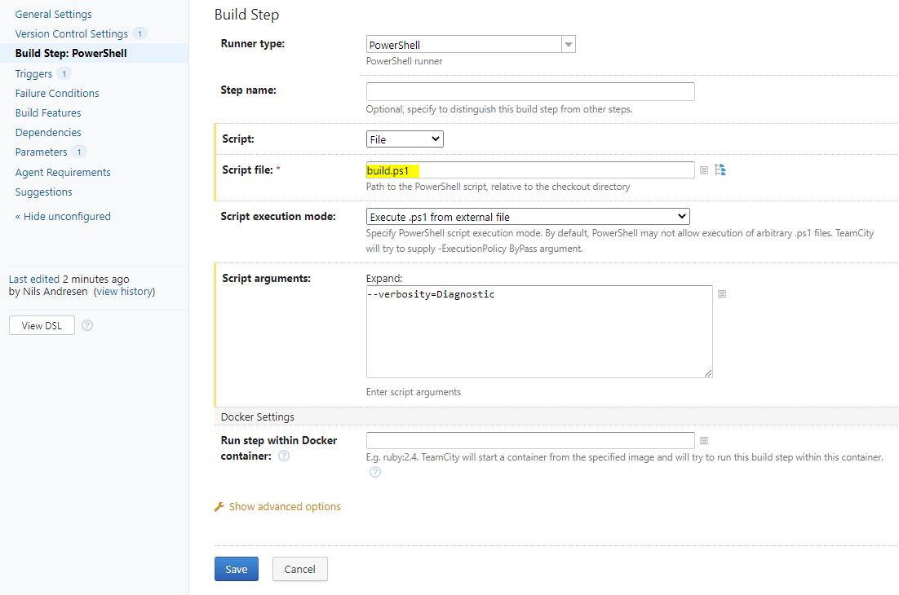

## Specifics

* `vcsroot.branch`-environment variable

  Exposing the `vcsroot.branch` parameter as an environment variable is required.

## Example Config

Generally, TeamCity is configured using the UI:

* Add a new build configuration to your project
* Select a VCS-Root
* Chose "configure build steps manually" (and skip auto-detection)
* Select "PowerShell" as Runner type 
* Add `build.ps1` as "Script file" and optionally some "Script arguments"

  {.img-responsive}
* Select "Parameters" and a new parameter
  * chose `env.vcsroot.branch` as Name,
  * "Environment Variable" as Kind,
  * `%vcsroot.branch%` as Value

  {.img-responsive}
* At this point you are done with the basic setup and can select "Run" to try the new configuration.

The following code shows the Kotlin DSL, as can be exported in TeamCity-UI. 
Though generally the build is configured using the TeamCity-UI.

```java
object Cake : BuildType({
    name = "Cake"

    params {
        param("env.vcsroot.branch", "%vcsroot.branch%")
    }

    vcs {
        root(SomeConfiguredVcsRoot)
    }

    steps {
        powerShell {
            scriptMode = file {
                path = "build.ps1"
            }
            noProfile = false
            param("jetbrains_powershell_scriptArguments", "--verbosity=Diagnostic")
        }
    }

    triggers {
        vcs {
        }
    }
})
```
